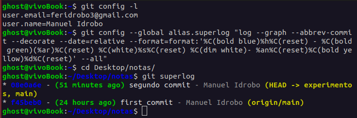
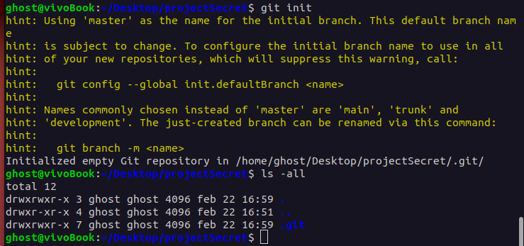
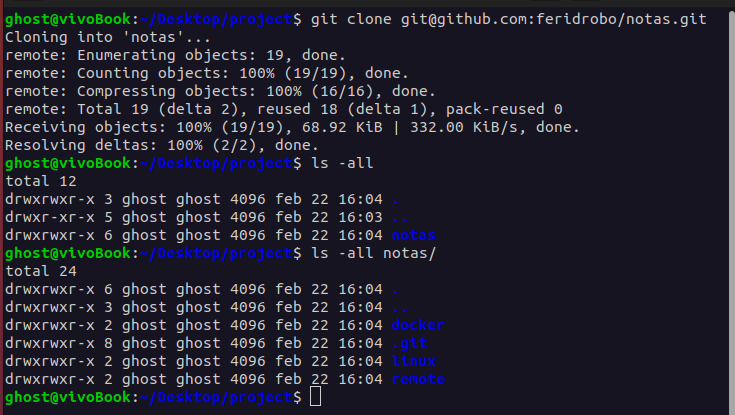

## Configuración básica:

- **git config:** Sirve para definir valores de configuración de Git a nivel de un proyecto global o local.

- **git init:** Crea un nuevo repositorio de Git.

- **git clone:** Este comando copia el repositorio de ejemplo y guarda la copia en la máquina local.

## Trabajo en equipo y colaboración:

- **git remote:** Muestra y administra los repositorios remotos configurados.

- **git fetch:** Descarga los cambios del repositorio remoto sin fusionarlos con tu copia local.

- **git pull:** Obtiene los cambios más recientes de un repositorio remoto y los fusiona con tu copia local.

- **git push:** Envía los cambios confirmados a un repositorio remoto.

- **git branch:** Muestra una lista de ramas en el repositorio y crea nuevas ramas.

- **git checkout:** Cambia a una rama o confirmación diferente.

- **git merge:** Combina los cambios de una rama en otra rama.

- **git rebase:** Reescribe el historial de confirmaciones de una rama para que parezca que se hizo sobre otra rama.

- **git cherry-pick:** Aplica los cambios de una confirmación específica a otra rama.

- **git pull-request:** Crea una solicitud de extracción en GitHub o en otro sistema de control de versiones.

## Trabajo con cambios y confirmaciones:

- **git add:** Agrega archivos al área de preparación (staging area) para ser confirmados.

- **git commit:** Registra los cambios en el repositorio, creando una nueva confirmación.

- **git stash:** Guarda temporalmente los cambios locales para poder trabajar en otra cosa y recuperarlos más tarde.

- **git reset:** Deshace cambios, moviendo el puntero HEAD a una confirmación anterior.

- **git revert:** Deshace una confirmación anterior creando una nueva confirmación con los cambios invertidos.

## Obtención de información sobre el repositorio:

- **git status:** Muestra el estado actual del repositorio, incluyendo los cambios pendientes de confirmación y los archivos no seguimientos.

- **git log:** Muestra el historial de confirmaciones del repositorio.

- **git diff:** Muestra las diferencias entre dos confirmaciones o entre una confirmación y el directorio de trabajo.

- **git blame:** Muestra quién modificó cada línea de un archivo y en qué confirmación se realizó.

- **git show:** Muestra información detallada sobre una confirmación específica.

## Herramientas avanzadas:

- **git bisect:** Encuentra la confirmación que introdujo un problema de manera interactiva.

- **git reflog:** Muestra un registro detallado de todas las operaciones realizadas en un repositorio.

- **git filter-branch:** Reescribe el historial de confirmaciones para aplicar cambios masivos a lo largo de todo el historial.