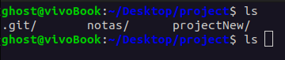
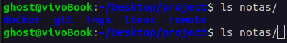
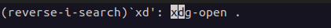
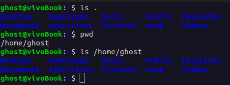

## Tabla de atajos en la terminal

| Atajo | Efecto |
| --- | --- |
| TAB | Muestra una lista de comandos disponibles que empiezan con esas letras |
| Tecla UP | Pasear por los comandos previamente usados (incluidos los de sesiones anteriores) |
| Ctrl + Shift + r | Activa una búsqueda hacia atrás de todos los comandos que has escrito |
| Punto "." | Hace referencia al directorio actual |
| Doble punto ".." | Hace referencia al directorio padre |
| cd ~ | Te desplaza directamente a tu home (la carpeta raíz de tu usuario en el OS) (~ = alt+126) |
| cd - | Te desplaza al último directorio visitado |
| cd .. | Te desplaza al directorio padre del directorio actual. (una carpeta hacia afuera) |
| < | "Redireccionar la entrada". Ingresa el contenido del archivo de la derecha como input para el comando de la izquierda |
| > | "Redireccionar la salida". Introduce el resultado del comando de la izquierda en el archivo de la derecha |
| Pipes (" \| ") | Toma la salida de un proceso y se la pasa como entrada al siguiente proceso |
| "&" al final del comando | Hace que el proceso se ejecute en segundo plano |
| Ctrl+z | Envía al proceso que esté en ejecución al Background. Puedes regresar el proceso al foreground con el comando fg |
| Ctrl+c | Detiene el proceso que se esté ejecutando en el foreground |
| Ejecutar un archivo ejecutable | Para ejecutar un archivo ejecutable, basta con introducir la ruta del archivo como si fuera un comando |
| source | Ejecuta en la terminal el archivo que escribas a continuación |
| sudo | Prefijo que se puede escribir antes del comando para ejecutarlo con permisos del usuario root |
| > /dev/null | Envía el resultado del comando al archivo /dev/null, que es un archivo tipo agujero negro que descarta todo lo que se introduce en él |
| Ctrl+l | Desplaza la pantalla hacia abajo para liberarla de texto |

## Practica ajemplos

- **TAB** 

- **Tecla UP**!

- **Ctrl + Shift + r**

- **Punto "."**

- **Doble punto "…"** 
- **cd ~**
- **cd -**
- **cd …**
- **<**
- **>**
- **Pipes (" \| ")**
- **"&"**
- **Ctrl+z**
- **Ctrl+c**
- **source**
- **sudo**
- **> /dev/null**
- **Ctrl+l**